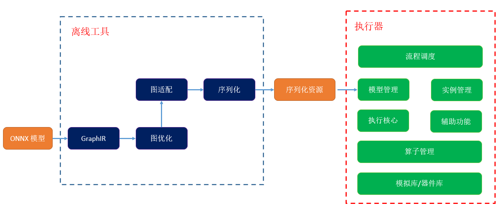

#### [English](./README_EN.md) | 简体中文

thinker是聆思科技开发的轻量级神经网络推理框架，结合量化训练工具[linger](https://github.com/LISTENAI/linger)，

为聆思科技的Venus系列、Arcs系列和VenusA系列芯片提供完整的深度学习平台解决方案。该平台集成了量化训练、计算图优化、

器件适配、性能评估、结果验证、引擎推理和高性能器件库等多个功能模块，支持计算机视觉、语音唤醒、语音识别和自

然语言理解等领域的深度学习算法在产品上快速落地。

***
## 框架特点

### 1. 超轻量执行器
  推理部分分为离线工具包和引擎执行器，将推理计算与非计算模块剥离，提升执行操作
* 离线组件tpacker负责简化计算图，适配目标平台和分析运行内存
* 执行器解析tpacker输出的资源，按规划顺序执行，无需额外操作
* 执行器代码采用纯C语言实现，全静态内存管理，无第三方依赖

### 2. 通用性
* 支持多种深度学习模型结构：图像、语音、MLP、attention、transformer等
* 支持多输入多输出ONNX量化计算图导入，支持动态shape
* 支持聆思的多个芯片平台，量化训练中带目标平台信息，执行器编译脚本中通过宏指令切换平台
* 支持32个常见量化算子（详见算子支持列表）

### 3. 易用性
* 丰富的离线工具箱：
  * 使用tpacker设置子图输入输出节点方便进行子图切分
  * tpacker打包可自动适配目标器件，简单情况下只需要指定计算图路径即可导出默认配置参数
  * 计算结果比对：
    * 训练与仿真结果对齐使用离线工具组件tvalidator，无需手动比对
    * 原理上仿真结果与芯片结果是比特级别对齐，如有异常可通过打印仿真平台和器件平台每层结果的CRC32进行比对（编译脚本中使能THINKER_RESULT_CRC_PRINT)
  * 离线组件tprofile负责对算法的性能进行软件仿真，快速得到评估结果

### 4. 高性能
* 通过linger可实现模型的全量化（激活int8，参数int4/int8/int16），量化可减少 12.5%-50% 的参数量，大幅减少参数传输时间
* 采用DMA预取参数与计算并行策略，相互掩盖耗时，提升推理效率
* 执行器集成高性能器件库，针对各系列芯片的NPU架构和存储情况进行优化，通过自定义指令码提升算力
***

## 快速开始
thinker与linger相互衔接，必须配合使用。整个工具链贯穿模型落地的整个生命周期，分为以下六个阶段：
### 1. 开发环境配置            
- [虚拟环境构建](./docs/thinker_environment.md)
- [源码编译安装](./docs/thinker_build.md)
- [docker镜像](./docs/thinker_docker.md)

源码和docker镜像二选一
### 2. 模型设计阶段
  算法研究人员在完成模型结构设计后，使用随机初始化参数过一遍linger+thinker工具链，评估参数可适配性、内存占用和运行效率，避免后期返工
  
### 3. 模型量化训练和导出
  linger作为pytorch的插件，支持一键导入。采用QAT量化方式，支持CV模型完全无损或基本无损量化。量化训练完成后，可一键导出。
  [模型量化训练和导出示例]

### 4. 模型分析和打包
  使用thinker离线组件tpacker对计算图的参数检查、计算图优化和内存分析，序列化为引擎执行器所需格式，并预分配运行内存。
  [打包参数说明及示例](./docs/thinker_packer.md)

### 5. 仿真平台代码编译
  shell终端在根目录下运行编译脚本即可，测试用例默认使用demo/test_thinker，可在根目录下的CMakeLists.txt中进行修改
  [编译参数说明及示例](./docs/thinker_compile.md)

### 6. 仿真平台运行及结果对比
  加载离线工具序列化的资源。在少量修改甚至零修改的情况下，实现计算图在目标芯片上的落地应用。
  [仿真平台运行示例](./docs/thinker_run.md)

### 7. 芯片平台代码编译
  在基础工程上添加thinker模块（将executor目录拷贝到对应工程中，并将名称修改为thinker即可）

### 8. 芯片平台运行及结果对比
  编译通过后，烧录后直接运行，统一仿真平台与芯片平台的输入文件，开启编译脚本中的宏接口进行中间结果的CRC32对比

### 9. 性能评估工具
  tprofile模块用于离线评估芯片性能。
  [使用方法和运行示例](./docs/thinker_profile.md)

### 10. 其它辅助功能
  查看算子性能统计和中间结果数据
  [辅助工具](./docs/thinker_performance.md)

## 能力展示
* [thinker API](./docs/thinker_api.md)
* [支持量化OP列表及限制说明](./docs/support_quant_ops.md)
***  

## 交流与反馈
- 欢迎您通过 Github Issues 来提交 BUG 与建议
- 技术交流微信群
***

## 引用
- [ONNX](https://github.com/onnx/onnx)
- [MNN](https://github.com/alibaba/MNN)
- [NCNN](https://github.com/Tencent/ncnn)
- [TNN](https://github.com/Tencent/TNN)

## 版权和许可证
[Apache-2.0 license](LICENSE)
***