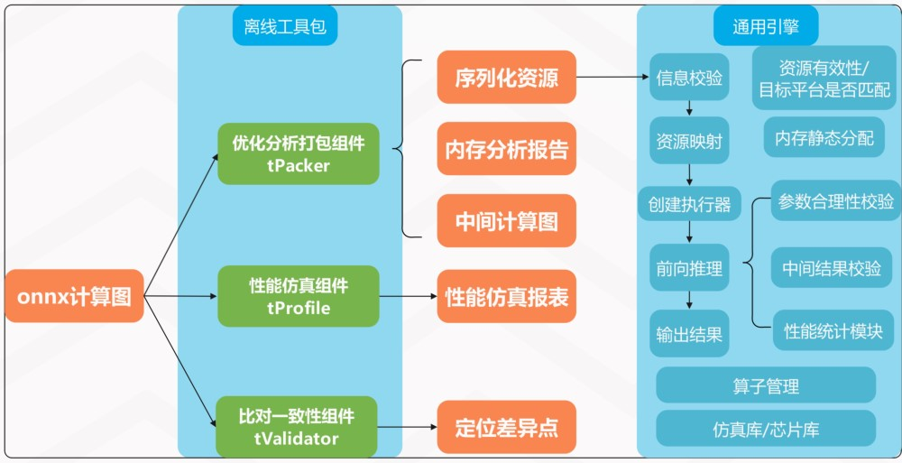

#### [English](./README_EN.md) | 简体中文

thinker是聆思科技开发的轻量级神经网络推理框架，是LNN 的通用推理引擎及配套工具集，通过模块化设计实现从计算图到芯片部署的全链路自动化处理

***
## 引擎框架
thinker采用模块化架构设计，通过解耦推理流程构建高效执行体系。系统由两大核心组件构成：

* 离线工具链：主要承载计算图优化、权重转换、内存预分配等预处理任务，形成标准化中间表示。同时具备性能仿真、一致性比对等辅助功能
* 轻量级运行时引擎：专注高性能推理执行，通过静态内存管理与硬件抽象层实现跨平台部署

**功能模块示意图**

## 核心技术优势

### 极简开发体验
* 离线工具包丰富，上手简单，支持各种一键式操作，正常情况下只需指定待处理计算图路径即可
* 零代码集成方案：引擎封装标准API接口，提供典型调用范例，典型场景仅需3步调用即可完成模型加载-推理-结果输出全流程
* 提供专业结果对比工具，轻松实现模型训练效果与芯片落地效果对齐
### 极致轻量化部署
* 双引擎协同机制：图优化器生成紧凑IR中间层，执行器仅保留最小必要运算单元，有效降低运行时负载
* 硬件亲和设计：执行器采用ANSI C编写，通过编译期链接选择适配目标平台，实现二进制级硬件优化
* 内存确定性保障：离线阶段完成全图内存拓扑分析，运行时采用静态内存池管理，消除动态分配开销
* 调试友好架构：单文件交付模式支持仿真/真实硬件环境秒级切换，异常定位效率提升80%
### 多模态兼容能力
* 异构模型支持：完整覆盖CV/NLP/ASR领域主流网络，原生兼容ResNet/Transformer/LSTM等50+经典架构
* 动态计算图处理：支持多分支输入/变长序列/实时流式数据，具备自动Batch合并与算子重排能力
* 开放扩展接口：提供ONNX标准算子库（含32+量化类型），支持用户自定义算子注册与热插拔加载
* 跨平台统一性：源码级平台无关设计，通过编译脚本宏配置即可生成Linux/VENUS/ARCS/VENUA平台版本
***

## 快速开始
thinker与linger相互衔接，必须配合使用。整个工具链贯穿模型落地的整个生命周期，分为以下六个阶段：
### 1. 开发环境配置            
- [开发环境构建](./docs/thinker_environment.md)
- [源码编译安装](./docs/thinker_build.md)
- [docker镜像](./docs/thinker_docker.md)

源码和docker镜像二选一
### 2. 模型设计阶段
  算法研究人员在完成模型结构设计后，使用随机初始化参数过一遍linger+thinker工具链，评估参数可适配性、内存占用和运行效率，避免后期返工
  
### 3. 模型量化训练和导出
  linger作为pytorch的插件，支持一键导入。采用QAT量化方式，支持CV模型完全无损或基本无损量化。量化训练完成后，可一键导出。
  * [模型量化训练和导出示例]

### 4. 模型分析和打包
  使用thinker离线组件tpacker对计算图的参数检查、计算图优化和内存分析，序列化为引擎执行器所需格式，并预分配运行内存。
  * [打包参数说明及示例](./docs/thinker_packer.md)

### 5. 仿真平台代码编译
  shell终端在根目录下运行编译脚本即可，测试用例默认使用demo/test_thinker，可在根目录下的CMakeLists.txt中进行修改
  * [编译参数说明及示例](./docs/thinker_compile.md)

### 6. 仿真平台运行及结果对比
  加载离线工具序列化的资源。在少量修改甚至零修改的情况下，实现计算图在目标芯片上的落地应用。
  * [仿真平台运行示例](./docs/thinker_run.md)
  * [运行结果比对工具](./docs/thinker_validator.md)

### 7. 芯片平台代码编译
  在基础工程上添加thinker模块（将executor目录拷贝到对应工程中，并将名称修改为thinker即可）

### 8. 芯片平台运行及结果对比
  编译通过后，烧录后直接运行，统一仿真平台与芯片平台的输入文件，开启编译脚本中的宏接口进行中间结果的CRC32对比

### 9. 性能评估工具
  tprofile模块用于离线评估芯片性能。
  * [使用方法和运行示例](./docs/thinker_profile.md)

### 10. 其它辅助功能
  查看算子性能统计和中间结果数据
  * [性能统计工具](./docs/thinker_performance.md)

## 能力展示
* [thinker API](./docs/thinker_api.md)
* [支持量化OP列表及限制说明](./docs/support_quant_ops.md)
***  

## 交流与反馈
- 欢迎您通过 Github Issues 来提交 BUG 与建议
- 技术交流微信群
***

## 引用
- [ONNX](https://github.com/onnx/onnx)
- [MNN](https://github.com/alibaba/MNN)
- [NCNN](https://github.com/Tencent/ncnn)
- [TNN](https://github.com/Tencent/TNN)

## 版权和许可证
[Apache-2.0 license](LICENSE)
***