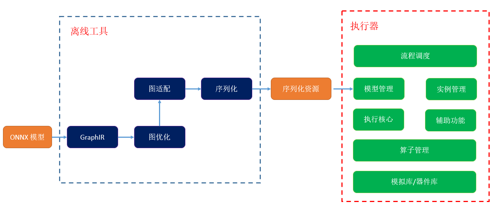
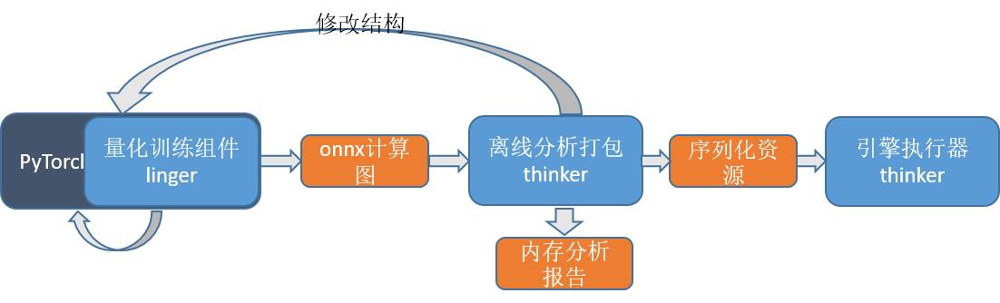

--------------------------------------------------------------------------------
#### [English](README_EN.md) | 简体中文

[](https://pypi.org/project/pythinker)
[](https://badge.fury.io/py/pythinker)
[](https://github.com/LISTENAI/thinker/blob/main/LICENSE)
[](https://github.com/LISTENAI/thinker/actions/workflows/linux_x86.yml)

thinker是聆思科技开发的轻量级神经网络推理框架，是聆思科技开源的AI生态工具链LNN(ListenAI Neural Network)的一部分，结合另一个聆思开源的量化训练组件[linger](https://github.com/LISTENAI/linger)可实现产业级深度学习训练推理一体化平台，集深度学习量化训练和引擎推理、LUNA器件库和丰富的辅助组件于一体。LNN是专为聆思AIOT芯片（目前只支持CSK60xx系列）定制开发，助力开发者轻松在聆思VENUS芯片上快速上线AI业务，帮助越来越多嵌入式尤其是AIOT产品实现AI赋能，助力产业智能化升级。目前LNN工具链支持聆思芯片在计算机视觉、语音唤醒、语音识别、离线翻译等10多个AI应用场景中的产品落地。

## 引擎框架
thinker将引擎执行器中的非核心功能尽量剥离出来放在离线工具中完成  


## 技术亮点
### 1. 轻量级部署
* 优化器和执行器分离，只需部署执行器
* 执行器架构基于C语言，能实现在嵌入式设备上的快速、高效部署
* 嵌入式版本无任何第三方库依赖，编译库小于200k
* 算子可选编译，可以进一步轻量化

### 2. 闭环量化生态
* 配合linger实现模型训练-量化落地的闭环
* 支持onnx量化扩展
* 支持全int8量化
* 无缝对接NPU,保证NPU结果与量化训练结果二进制一致

### 3. 高效开发
* 上手简单，支持各种一键式操作，实现训练、转换、流式执行一条龙
* 接口简单易用，提供各种调用范例，仅以少量改动即可完成模型部署
* 跨平台模型统一、调用接口统一，模拟代码与芯片代码保持统一

## 快速入门
- [安装](thinker/docs/tutorial/install.md)：支持pip、源码、docker三种安装方式
- [资源打包](thinker/docs/tutorial/thinker_packer.md)：指定计算图即可自动完成图分析和资源序列化
- [推理执行](thinker/docs/tutorial/thinker_run.md)：指定资源位置，给定输入输出路径即可完成引擎的执行
- [辅助工具](thinker/docs/tutorial/thinker_performance.md)：查看模型内存占用、效率评估和打印中间结果

## 工程示例
  AI算法落地基本涵盖六个阶段：模型规约性检查、浮点训练、量化训练、模型打包、模拟引擎执行、固件烧录并芯片运行。其中固件烧录并芯片运行需要在聆思的开发板上来完成，如有需要请与我们联系，这里不做进一步介绍。其它五个阶段的流程示例图如下：  
      
  其中模型规约性检查的功能是穿插在量化训练和模型打包中来完成的。  
  我们先假设模型结构与底层硬件完全适配，介绍流程中各个阶段，再介绍模型规约性检查的具体实现（实际开发过程中规约性检查要在模型结构初步进行，避免后续工作返工）。
### 1. 浮点训练
  我们基于[pytorch-cifar100](https://github.com/weiaicunzai/pytorch-cifar100)来进行功能展示  
  首先确保在当前环境下，浮点模型训练基于pytorch能够跑起来。 
```Shell
python train.py -net resnet50 -gpu
```
  建议采用两阶段量化训练，对浮点训练的数据进行范围约束，只需[添加少量代码](thinker/docs/tutorial/resnet_modify1.md).  
  为避免冲突，将tesnorboard[功能关闭](thinker/docs/tutorial/resnet_modify2.md)。同样的指令开启训练，运行几个epoch后，在checkpoint/resnet50文件夹中生成了一个**.pth文件

### 2. 量化训练和导出
  加载步1中保存的浮点模型**.pth，[修改约束代码](thinker/docs/images/linger_set2.png)，即可将浮点算子替换为量化算子。同样的指令开启量化训练，训练几个epoch后，同样在checkpoint/resnet50文件夹中生成了一个**.pth文件。
  使用linger的模型转换工具，将[模型转换成onnx计算图](thinker/docs/images/onnx_export.png)。

### 3. 模型分析和打包
  使用thinker离线工具tpacker对步2生成的onnx计算图打包，这里我们以训练好的resnet18模型为例，进行打包
```Shell
tpacker -g demo/resnet18/resnet18-12-regular.onnx -d True -o demo/resnet18/model.bin
```

### 4. 推理执行
  使用调用示例工程test_thinker，指定输入数据、资源文件和输出文件名称即可运行模拟代码。  
```Shell
chmod +x ./bin/test_thinker
./bin/test_thinker demo/resnet18/input.bin demo/resnet18/model.bin demo/resnet18/output.bin 3 32 32 6
```
这里简化整体处理流程，引擎输入为规整后的3x32x32的图片，输出取max_value对应的id作为分类的结果。输入图片的处理参考[图片处理脚本](tools/image_preprocess.py)，或者从pytorch-cifar100中取处理后的测试集图片进行测试。
另外可通过修改编译脚本来查看[算子性能和中间数据的结果](thinker/docs/tutorial/thinker_performance.md)

### 5. 规约性检查
  该阶段不关注模型的效果，只关注模型的结构是否和底层硬件相适配，功能实现贯穿了1~4步
  * 在步1中，对模型参数进行初始化或者训练几个epoch即可将模型文件导出，无需模型收敛。
  * 步2中加载步1的模型文件，进行量化训练时，会对算子参数的合规性进行检查，如有不符合的设置，报错退出[错误示例](thinker/docs/images/resnet50_linger_err.png)。用户根据报错信息修改层参数并返回步1，直至通过步2。
  * 步3中加载步2的计算图，工具会对节点的tensor大小进行检查，[如果tensor大小超限会报错退出](thinker/docs/images/Resnet50_err.png)。否则进入内存分析阶段，会在根目录下生成[内存分析报告](thinker/docs/images/Resnet50_Mem1.png)，并提示整体的flash/psram/share-memory占用。对于超过硬件限制的报错，用户可结合报错信息和[内存分析报告](thinker/docs/images/Resnet50_Mem2.png)来定位计算图中的超限的算子，返回步1进行模型结构调整，直至[通过步3的打包流程](thinker/docs/images/Resnet50_sucess.png)。   
  至此完成模型规约性检查，确保了模型能够在芯片上能够跑起来。模型效率评估目前只支持在芯片上部署运行，具体需求可联系我们。  

## 能力展示
* [thinker API](thinker/docs/tutorial/thinker_api.md)
* [支持量化OP列表](https://github.com/LISTENAI/linger/blob/main/doc/tutorial/support_quant_ops.md)及[模型结构限制说明](thinker/docs/tutorial/restrain_of_model.md)

## 应用示例
* 鼾声检测[https://github.com/mywang44/snoring_net]

## 版本说明
- 请参考[RELEASE](doc/tutorial/release.md)

## 交流与反馈
- 欢迎您通过 Github Issues 来提交 BUG 与建议
- 技术交流微信群  


## 引用
- [ONNX](https://github.com/onnx/onnx)
- [pytorch-cifar100](https://github.com/weiaicunzai/pytorch-cifar100)

## 版权和许可证
- thinker 由 [Apache-2.0 license](LICENSE) 提供
