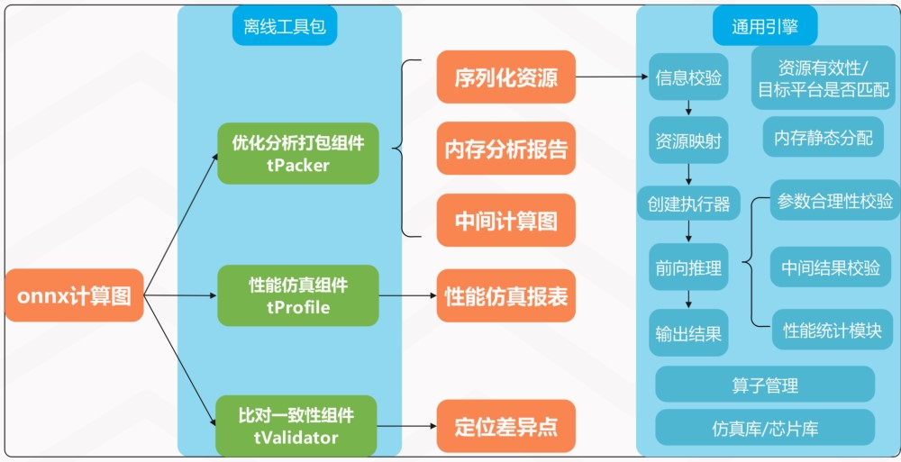

#### [English](./README_EN.md) | 简体中文

# Thinker

Thinker 是聆思科技开发的轻量级神经网络推理框架，也是 LNN 的通用推理引擎及配套工具集。它与量化训练工具 Linger 配合使用，覆盖从模型量化、图优化、设备适配、性能评估、结果验证到端侧推理部署的完整链路，帮助 CV、ASR、NLP 等算法快速落地到聆思芯片平台。

## 项目定位

Thinker 面向资源受限的端侧芯片场景，核心目标是让模型在保持精度可控的前提下，以更低的内存占用、更小的运行时负载和更高的硬件利用率完成部署。

- **完整链路**：串联 Linger 量化训练、离线图分析、资源打包、仿真验证与芯片运行。
- **轻量运行时**：执行器采用纯 C 实现，静态内存管理，无第三方运行时依赖。
- **硬件适配**：通过 `DTHINKER_TARGET_PLATFORM` 和相关编译选项适配 VENUS、ARCS、VENUSA 等目标平台；x86/Linux 侧运行主要用于目标平台仿真验证，Thinker 上层代码与真实芯片平台保持通用。
- **部署友好**：离线阶段完成图优化、参数检查和内存规划，运行时只负责加载资源并按计划执行。

## 引擎框架

Thinker 采用模块化架构，将离线处理和在线执行解耦，形成稳定、可验证、易移植的推理体系。

- **离线工具链**：负责计算图优化、权重转换、参数合法性检查、内存预分配、性能仿真和一致性比对，最终生成标准化中间表示与运行资源。
- **轻量级运行时引擎**：负责解析离线工具生成的资源文件，并在静态内存池与硬件抽象层之上完成高性能推理执行。

说明：仓库中的 x86 运行示例和测试工程用于目标平台仿真验证，便于在 PC 侧快速完成资源检查、算子适配和结果对比。切换到真实芯片平台时，Thinker 的上层接口、资源格式和主体代码保持一致，通常只需要替换目标平台对应的底层 `luna` 库和固件/BSP 库，并将模块接入实际 SDK 工程。

**功能模块示意图**

## 核心优势

### 极简开发体验

- 离线工具包覆盖模型检查、打包、仿真、性能评估和结果对比，常规场景只需指定待处理计算图路径即可完成处理。
- 引擎封装标准 C API，并提供典型调用示例；多数场景仅需“模型加载 -> 推理执行 -> 结果输出”三步即可集成。
- 提供专业结果比对工具，便于对齐训练端、仿真端和芯片端结果，降低问题定位成本。

### 极致轻量化部署

- 图优化器生成紧凑 IR，执行器仅保留必要的计算和调度逻辑，显著降低运行时负载。
- 执行器采用 ANSI C 编写，通过 `DTHINKER_TARGET_PLATFORM` 等编译期配置选择目标平台，实现二进制级硬件适配。
- 离线阶段完成全图内存拓扑分析，运行时采用静态内存池，避免动态内存分配开销。
- 单文件资源交付方式支持仿真环境与真实硬件快速切换；迁移到芯片侧时通常只需替换底层 `luna` 库和固件/BSP 库。

### 多模态兼容能力

- 支持 CV、NLP、ASR 等常见模型类型，覆盖 ResNet、Transformer、LSTM 等经典网络结构。
- 支持多输入、多输出、分支结构、变长序列和流式数据等复杂计算图场景。
- 支持 ONNX 标准算子与常用量化算子，并提供自定义算子扩展入口。
- 源码级平台无关设计，通过统一源码和 `DTHINKER_TARGET_PLATFORM` 即可生成不同目标平台版本。

### 性能与可验证性

- 通过 Linger 支持激活 int8、参数 int4/int8/int16 等量化形式，降低模型体积和数据搬运成本。
- 结合 DMA 预取、算子重排和硬件专用库提升端侧推理效率。
- 支持 tvalidator 结果验证、CRC32 中间结果比对和 tprofile 性能评估，便于形成可复现的部署闭环。

## 版本信息

- 当前仓库文档对应版本：`v3.0.12`
- 最近一次发布：`2026-06-29`
- 本版本重点：统一目标平台配置入口，新增多资源 / 流式仿真示例，系统整理文档结构
- 详细变更记录：见 [发布说明](./docs/release_note.md)

## 快速开始

Thinker 与 Linger 需要配合使用。推荐按照以下流程完成从模型设计到芯片运行的部署闭环。

### 1. 开发环境搭建

- [开发环境搭建（含本地与 Docker 方案）](./docs/thinker_environment.md)
- [源码安装与 Python 工具链](./docs/thinker_build.md)

### 2. 模型设计阶段

算法研究人员在完成模型结构设计后，可使用随机初始化参数先跑通 Linger + Thinker 工具链，用于评估算子适配性、内存占用和运行效率，提前规避后续部署返工。

### 3. 模型量化训练和导出

Linger 作为 PyTorch 插件支持一键导入，采用 QAT 量化方式，适用于 CV 等模型的无损或近似无损量化。量化训练完成后，可导出 Thinker 离线工具链可处理的计算图。
具体使用方法请参考 [Linger 模型量化训练](https://github.com/listenai/Linger)。

### 4. 模型分析和打包

使用 Thinker 离线组件 tpacker 对计算图进行参数检查、图优化、内存分析和资源序列化，并预分配运行内存。

- [打包参数说明及示例](./docs/thinker_packer.md)

### 5. 仿真平台代码编译

在仓库根目录运行编译脚本即可构建 x86/Linux 仿真平台。该版本主要用于目标平台行为仿真、资源验证和结果对比，并不直接生成芯片固件镜像。测试用例默认使用 `demo/test_thinker`，也可以在根目录 `CMakeLists.txt` 中按需修改；如需切换仿真目标平台，可修改脚本中的 `DTHINKER_TARGET_PLATFORM`。

- [编译参数说明及示例](./docs/thinker_compile.md)

### 6. 仿真平台运行及结果对比

加载离线工具序列化后的资源文件，在少量修改甚至零修改的情况下完成仿真推理，并通过验证工具对齐训练端与仿真端结果。这里的推理执行本质上是对目标平台行为的仿真验证，不是芯片固件镜像直接运行；但示例中的 Thinker 接口和主体流程可直接复用于芯片工程。

- [仿真平台运行示例](./docs/thinker_run.md)
- [运行结果比对工具](./docs/thinker_validator.md)

### 7. 芯片平台代码编译

在固件的基础 SDK 工程中添加 Thinker 模块：将 `executor` 目录拷贝到目标工程，并按工程规范重命名或挂载为 `thinker` 模块。Thinker 上层代码与仿真平台通用，迁移到真实芯片平台时通常只需要替换目标平台对应的底层 `luna` 库和固件/BSP 库。
注：固件的基础 SDK 工程需咨询我们的 FAE 获取。

### 8. 芯片平台运行及结果对比

芯片工程编译通过后，烧录并运行程序。建议统一仿真平台与芯片平台的输入文件，并开启编译脚本中的 `DTHINKER_RESULT_CRC_PRINT`，验证中间结果一致性。

### 9. 性能评估工具

`tprofile` 模块用于离线评估芯片性能。

- [使用方法和运行示例](./docs/thinker_profile.md)

### 10. 其它辅助功能

Thinker 还提供算子性能统计、中间结果数据查看等辅助能力，便于定位性能瓶颈和数值差异。

- [辅助工具](./docs/thinker_performance.md)

## 文档导航

| 文档 | 说明 |
| --- | --- |
| [开发环境搭建（本地 / Docker）](./docs/thinker_environment.md) | 本地与 Docker 开发环境说明 |
| [源码安装与 Python 工具链](./docs/thinker_build.md) | Thinker Python 工具链安装与升级 |
| [仿真平台编译](./docs/thinker_compile.md) | x86/Linux 仿真编译参数与示例 |
| [离线打包工具](./docs/thinker_packer.md) | tpacker 参数、流程和示例 |
| [仿真运行](./docs/thinker_run.md) | 仿真平台运行方法 |
| [结果验证](./docs/thinker_validator.md) | 训练端、仿真端和芯片端结果对比 |
| [离线性能评估](./docs/thinker_profile.md) | tprofile 使用说明 |
| [性能统计与辅助工具](./docs/thinker_performance.md) | 算子统计和中间数据查看 |
| [支持量化 OP 列表及限制说明](./docs/support_quant_ops.md) | 量化算子、精度和参数限制 |
| [Thinker API](./docs/thinker_api.md) | 引擎 API 与典型调用方式 |
| [技术亮点](./docs/thinker_technical_highlights.md) | 框架设计与关键技术说明 |
| [发布说明](./docs/release_note.md) | 版本更新记录 |

## 交流与反馈

- 欢迎通过 GitHub Issues 提交 Bug、需求和改进建议。
- 项目持续迭代中，版本变化可参考 [发布说明](./docs/release_note.md)。
- 如需技术交流，可加入项目技术交流微信群。

## 引用

- [ONNX](https://github.com/onnx/onnx)
- [MNN](https://github.com/alibaba/MNN)
- [NCNN](https://github.com/Tencent/ncnn)
- [TNN](https://github.com/Tencent/TNN)

## 版权和许可证

本项目基于 [Apache-2.0 license](LICENSE) 发布。
