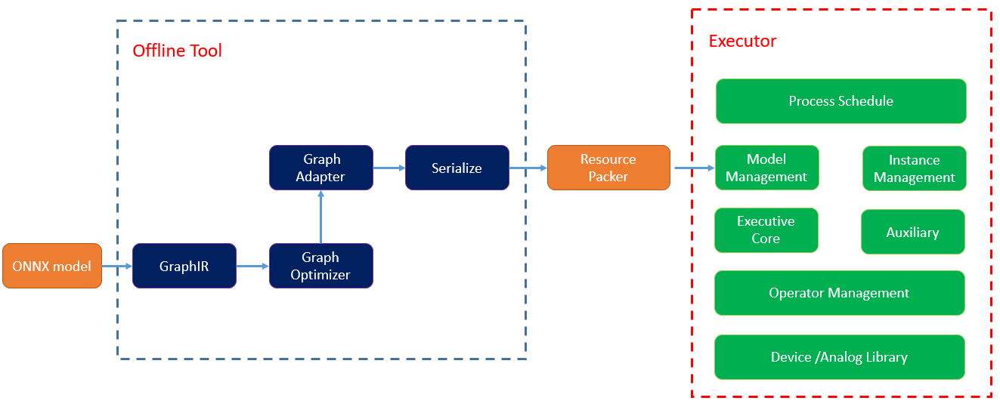

#### English | [简体中文](./README.md)

# Welcome to the Thinker GitHub
Thinker is a lightweight neural network inference framework developed by LISTENAI Technology, combined with the quantization training tool Linger. It provides a complete deep learning platform solution for the Venus, Arcs, and VenusA series chips from LISTENAI. The platform integrates multiple functional modules including quantization training, graph optimization, device adaptation, performance evaluation, result verification, engine inference, and high-performance device libraries, supporting rapid deployment of deep learning algorithms in fields such as computer vision, voice wake-up, speech recognition, and natural language understanding.
***

## Frame Features:

### 1. Ultra-lightweight Executor
- The inference part is divided into offline tools and engine executors, stripping non-computation-related operations.
- The offline tool tpacker simplifies the computation graph, adapts it to the target platform, and analyzes runtime memory.
- The executor parses the output of tpacker and executes it in the planned order without additional operations.
- The executor is implemented in pure C language with full static memory management and no third-party dependencies.

### 2. Generality
- Supports multiple deep learning model structures: images, speech, MLP, attention, transformers, etc.
- Supports multi-input and multi-output ONNX quantized computation graphs with dynamic shapes.
- Supports multiple LISTENAI chip platforms, with platform information included in quantization training and switched via macros in the compilation script.
- Supports 32 common quantization operators (see the operator support list for details).

### 3. Usability
- Rich offline toolset:  
  Use tpacker to set input/output nodes for subgraph splitting.  
  tpacker automatically adapts to target devices, requiring only the computation graph path in simple cases.
- Result comparison:  
  Use the offline tool tvalidator to align training and simulation results without manual comparison.  
  Simulation results are bit-level aligned with chip results.   
  CRC32 comparison can be enabled via compilation script (set THINKER_RESULT_CRC_PRINT true).
- The offline tool tprofile evaluates algorithm performance through software simulation.

### 4. High Performance
- Achieves full model quantization (activation int8, parameters int4/int8/int16) via Linger, reducing parameter size by 12.5%-50% and transmission time.
- Uses DMA pre-fetching and parallel computation strategies to improve inference efficiency.
- Integrates high-performance device libraries optimized for chip architectures and memory configurations, with custom instruction codes enhancing computing power.

## Quick Start
Thinker and Linger are interconnected and must be used together. The toolchain covers the entire model deployment lifecycle and is divided into the following stages:
### 1.  Development Environment Setup
- [Virtual Environment Setup](./thinker/docs/thinker_environment.md)
- [Source Code Compilation & Installation](./thinker/docs/thinker_build.md)
- [Docker Image (includes Linger and Thinker)](./thinker/docs/thinker_docker.md)

### 2. Model Design
After finishing the model structure design, algorithm researchers use random initialization parameters to go through the linger+thinker tool chain, which evaluates the model's parameter adaptability, memory consumption and running efficiency to avoid design rework later on when the application needs are not met.

* [Example Tutorial 2](./thinker/docs/thinker_docker.md)

### 3. Model Quantization Training & Export
Linger is a plug-in for pytorch and can be imported with one click. Linger uses QAT quantization, which is completely or basically lossless for CV models. After the quantization training is completed, the model can be exported with a single click using its own tools.
* [Example Tutorial 3](./docs/thinker_docker.md)

### 4. Model Analysis & Packing
Parameter checking of the computational graph, computational graph optimization and memory analysis checking using Thinker's offline tool tpacker. Finally, the computational graph is serialized into the format required by the engine executor and the runtime memory is pre-allocated.
* [Example Tutorial 4](./docs/thinker_packer.md)

### 5. Simulation Platform Compilation
Directly load resources serialized by offline tools. Implement computational graphs on VENUS chips with few or even zero modifications.
* [Example Tutorial 5](./docs/thinker_run.md)

### 6. Simulation Platform Execution & Result Comparison
View operator performance statistics and intermediate result data
* [Example Tutorial 6](./docs/thinker_performance.md)

### 7. Chip Platform Compilation
Add the Thinker module to the base project (copy the executor directory and rename it to thinker).

### 8. Chip Platform Execution & Result Comparison
After compilation, burn and run. Use CRC32 comparison for intermediate results via compilation macros.

### 9. Performance Evaluation Tools
tprofile evaluates chip performance offline.
[Usage & Examples](./docs/thinker_profile.md)

### 10. Auxiliary Functions
View operator performance statistics and intermediate data.
Auxiliary Tools

***
## Ability Demonstration
  * [Thinker API](./docs/thinker_api.md)
  * [Supported Quantization Operators & Limitations](./docs/support_quant_ops.md)
***  

## Communication and Feedback
* Submit bugs and suggestions via GitHub Issues
* Join the technical discussion WeChat group  
***  

## Citation
- [ONNX](https://github.com/onnx/onnx)
- [MNN](https://github.com/alibaba/MNN)
- [NCNN](https://github.com/Tencent/ncnn)
- [TNN](https://github.com/Tencent/TNN)
***

## Copyright and License
[Apache-2.0 license](LICENSE)
***

