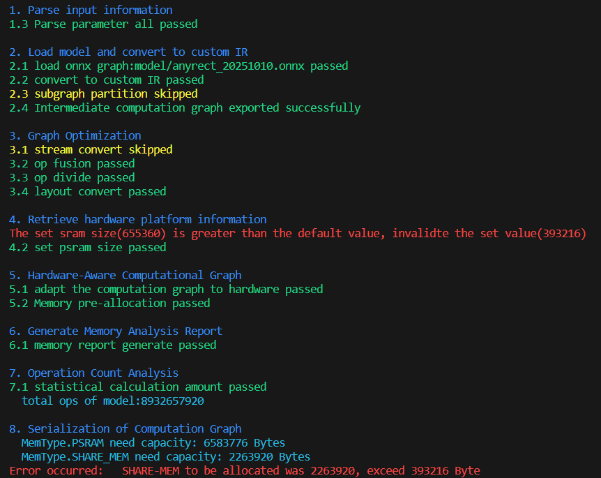
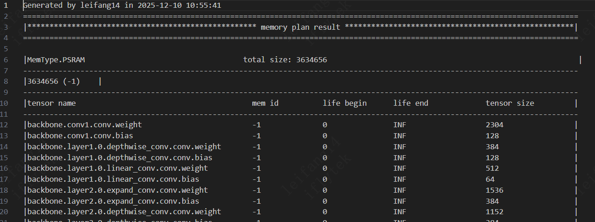
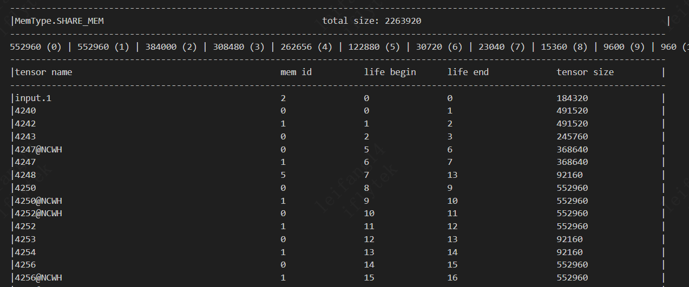
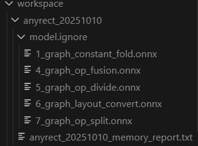

tpacker 是 Thinker 框架中的一个关键离线工具，主要用于对 ONNX 计算图进行加载、解析、优化和内存分析。它能够将优化后的计算图序列化为资源文件（默认存放在根目录下，文件名为 model.pkg），以便在目标芯片上进行高效推理。

## 命令格式
```Shell
tpacker [选项]
```
注意：至少需要提供以下其中一个参数：
* -g/--graph_path：输入 ONNX 模型的路径
* --config_file：配置文件路径（JSON 格式）
## 参数配置说明
### 基本配置
| 选项 | 类型 | 默认值 | 描述 | 示例 |
|-------|-------|-------|-------|-------|
| -g, --graph_path | 字符串 | 必须配置|输入 ONNX 模型的路径 | tpacker -g xx.onnx |
| -o, --output_path | 字符串 | model.pkg |输出的源的路径 | tpacker -g xx.onnx -o output/model.pkg |
| -d, --dump | 布尔值 | True | 中间计算图导出开关 | tpacker -g xx.onnx -d False |
| --config_file | 字符串 | 无 | 配置文件路径（JSON 格式）| tpacker --config_file xx.json |
| --export_config | 字符串 | 无 | 将当前配置导出到 JSON 文件 | tpacker -g xx.onnx --export_config xx.json |

### 计算图相关配置
| 选项 | 类型 | 默认值 | 描述 | 示例 |
|-------|-------|-------|-------|-------|
| --inputs | 字符串 | 空字符串 | 如需切分子图时，逗号分隔的输入节点名称列表 | tpacker -g xx.onnx --inputs input1,input2 |
| --outputs | 字符串 | 空字符串 | 如需切分子图时，逗号分隔的输出节点名称列表 | tpacker -g xx.onnx --outputs output1,output2 |
| --dynamic_shape | 字符串 | 空字符串 | 如输入中有个维度可变，动态形状配置（例如：name1=min:max:factor） | tpacker -g xx.onnx --dynamic_shape name1=1:10:2 |
| --isstream | 字符串 | None | 是否启用流处理功能（可选值：None, "split_h", "split_w"）| tpacker -g xx.onnx --isstream split_h |

### 目标平台配置
| 选项 | 类型 | 默认值 | 描述 | 示例 |
|-------|-------|-------|-------|-------|
| -p, --platform | 字符串 | venus | 目标平台（可选值：venus, mars, arcs, venusa） | tpacker -g xx.onnx -p venus |
| -r, --ramsize | 整数 | 640KB | 最大有效共享内存大小 | tpacker -g xx.onnx --ramsize 1048576 |
| --psramsize | 整数 | 8MB | 最大有效 PSRAM 大小 | tpacker -g xx.onnx --psramsize 16777216 |

### 内存分配相关配置
| 选项 | 类型 | 默认值 | 描述 | 示例 |
|-------|-------|-------|-------|-------|
| --dma_prefetch | 布尔值 | True | DMA 预取功能开关 | tpacker -g xx.onnx --dma_prefetch False |
| -m, --memory | 字符串 | 空字符串 | 指定节点数据的存储位置（PSRAM 或共享内存） | tpacker -g xx.onnx --memory inputs[0]:share-memory |
| --threshold1 | 整数 | 640KB | 单个卷积运算符的最大权重大小 | tpacker -g xx.onnx --threshold1 1048576 |
| --threshold2 | 整数 | 640KB | 单个卷积运算符的最大输出大小 | tpacker -g xx.onnx --threshold2 1048576 |
| --threshold3 | 整数 | 640KB | 单个线性运算符的最大输出大小 | tpacker -g xx.onnx --threshold3 1048576 |
| --threshold4 | 整数 | 640KB | 共享内存中节点的最大大小 | tpacker -g xx.onnx --threshold4 1048576 |

## 打包指令示例
### 示例1：基本使用
```Shell
tpacker -g xx.onnx
```
### 示例2：导出配置文件
```Shell
tpacker -g xx.onnx --export_config config.json
```
### 示例3：配置文件使用
```Shell
tpacker --config_file config.json
```
## 示例4：动态形状配置(输入中变量name1和name2)
```Shell
tpacker -g xx.onnx --dynamic_shape name1=1:10:2,name2=3:20:3
```
或者
```Shell
tpacker --config_file config.json --dynamic_shape name1=1:10:2,name2=3:20:3
```
### 示例 5: 内存配置（指定某个节点的存储位置psram/share-memory及限制可用的ram大小)
```Shell
tpacker -g xx.onnx --memory inputs[0]:share-memory --threshold1 1048576 --ramsize 393216
```
### 示例 6: 内存配置设置并保持配置参数
```Shell
tpacker --config_file config.json --memory inputs[0]:share-memory --threshold1 1048576 --export_config config.json
```
## 工具输出
### 终端显示

每个阶段的处理步骤，用不同颜色标识不同状态：
  * 绿色：正常完成
  * 黄色：跳过
  * 红色：参数设置不合理
### 内存分析报告
* 模型参数内存分配示意图    

* 运行内存分析规划示意图

内存按块进行复用，每个块有独立的编号，每个节点有数据大小和生命周期
### 中间计算图
  
默认导出计算图优化每一步骤的中间计算图，默认路径为./workspace/xx/model.ignore/*.onnx，其中xx表示输入计算图的名称（名称中如果有"."则取第一个字段）

### 计算量统计
* 终端打包过程中会打印统计的计算量

### 打包指令配置文件
* 通过export_config指令开启配置文件导出功能并指定导出的文件路径及文件名称
### 序列化资源
* 默认输出为当前目录下的model.pkg，可通过-o指定输出路径和文件名称
