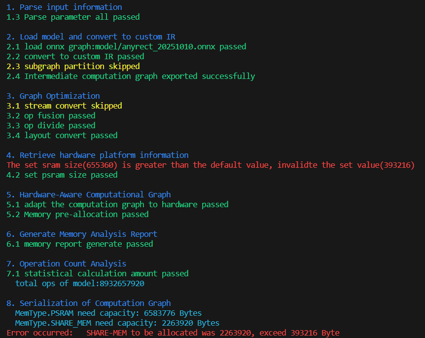
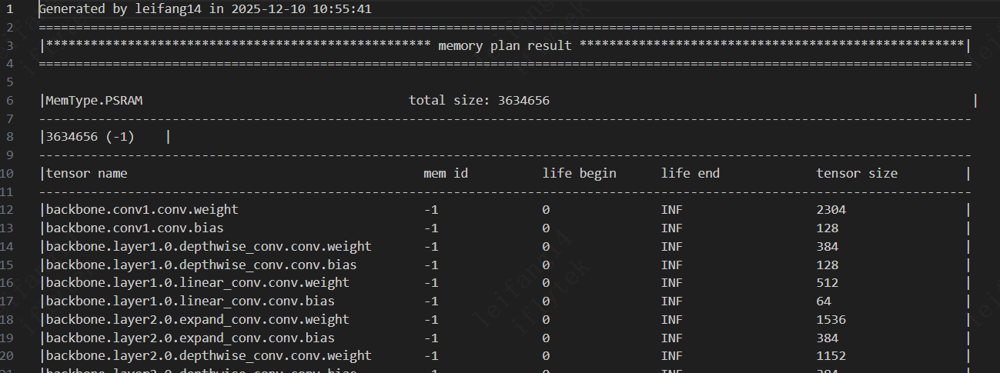
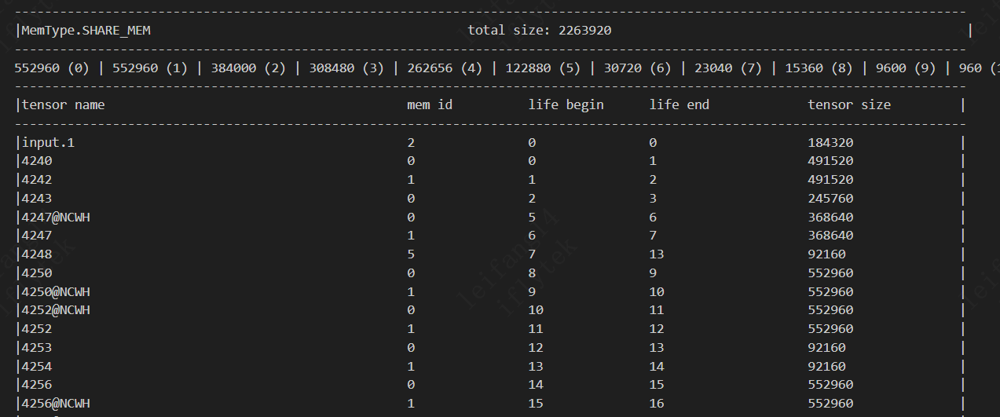

# Thinker `tpacker` 使用指南

`tpacker` 是 Thinker 的核心离线工具，用于加载 ONNX 计算图、执行图优化与硬件适配、分析内存需求，并最终序列化生成可供 Thinker 运行时加载的资源文件。

> 说明
>
> - `tpacker` 生成的资源既可用于 x86/Linux 仿真验证，也可用于真实目标平台集成。
> - x86/Linux 侧的推理执行本质上是目标平台行为仿真，但资源格式、上层接口和主体流程可直接复用于芯片工程。
> - 迁移到真实目标平台时，通常只需要替换底层 `luna` 库和固件/BSP 库，并按实际 SDK 工程接入资源加载与内存管理逻辑。

## 1. 使用前准备

建议先完成以下准备工作：

- 已完成开发环境搭建：参考 `./thinker_environment.md`
- 已安装 Thinker Python 工具链：参考 `./thinker_build.md`
- 输入模型为 ONNX 格式

## 2. 快速开始

最常见的打包方式如下：

```bash
tpacker -g model.onnx -o model.pkg
```

该命令会完成：

- ONNX 模型加载与解析
- 计算图优化
- 目标平台适配与内存规划
- 资源文件序列化输出

如果希望同时导出中间图和内存分析结果，可开启 `dump`：

```bash
tpacker -g model.onnx -d True -o model.pkg
```

## 3. 命令格式

```bash
tpacker [options]
```

至少需要提供以下参数之一：

- `-g, --graph_path`：输入 ONNX 模型路径
- `--config_file`：配置文件路径（JSON 格式）

## 4. 常用参数说明

### 4.1 基本参数

| 选项 | 类型 | 默认值 | 说明 |
| --- | --- | --- | --- |
| `-g, --graph_path` | 字符串 | 无 | 输入 ONNX 模型路径 |
| `-o, --output_path` | 字符串 | `model.pkg` | 输出资源文件路径 |
| `-d, --dump` | 布尔值 | `False` | 是否导出中间图和分析信息 |
| `--config_file` | 字符串 | 无 | 从 JSON 配置文件读取参数 |
| `--export_config` | 字符串 | 无 | 将当前参数导出为 JSON 配置文件 |

说明：

- `graph_path` 与 `config_file` 二选一至少提供一个。
- `dump=False` 时，工具仍会正常输出打包阶段日志和最终资源文件，只是不额外导出中间图与分析报告。

### 4.2 计算图相关参数

| 选项 | 类型 | 默认值 | 说明 |
| --- | --- | --- | --- |
| `--inputs` | 字符串 | 空 | 切分子图时指定输入节点，多个节点以逗号分隔 |
| `--outputs` | 字符串 | 空 | 切分子图时指定输出节点，多个节点以逗号分隔 |
| `-c, --dynamic_shape` | 字符串 | 空 | 动态 shape 配置，格式如 `name=min:max:factor` |
| `-s, --strategy` | 字符串 | 无 | 图优化策略，目前支持 `Remove_QuantDequant` |
| `--isstream` | 字符串 | 无 | 流式切图配置，可选 `split_h` 或 `split_w` |

说明：

- `--inputs` / `--outputs` 常用于将大图拆分为多个资源，或仅导出其中一段子图。
- `--dynamic_shape` 支持一个或多个动态轴配置，例如 `seq_len=32:384:32`。
- `--isstream` 常用于流式模型或超大图拆分场景。

### 4.3 目标平台与设备参数

| 选项 | 类型 | 默认值 | 说明 |
| --- | --- | --- | --- |
| `-p, --platform` | 字符串 | 无 | 目标平台，可选 `venus`、`mars`、`arcs`、`venusa` |
| `-r, --ramsize` | 整数 | `655360` | 最大可用共享内存大小，单位为字节 |
| `--psramsize` | 整数 | `8388608` | 最大可用 PSRAM 大小，单位为字节 |

说明：

- 如果显式指定 `--platform`，其取值必须与图中目标平台信息一致，否则会报错。
- `655360` 字节约等于 `640 KB`，`8388608` 字节约等于 `8 MB`。

### 4.4 内存预分配参数

| 选项 | 类型 | 默认值 | 说明 |
| --- | --- | --- | --- |
| `--dma_prefetch` | 布尔值 | `True` | 是否启用 DMA 预取 |
| `-m, --memory` | 字符串 | 空 | 手动指定节点存储位置，格式为 `node:psram`、`node:share-mem` 或 `node:flash` |
| `--threshold1` | 整数 | `655360` | 卷积类算子的最大权重块阈值 |
| `--threshold2` | 整数 | `655360` | 卷积类算子的最大输出块阈值 |
| `--threshold3` | 整数 | `655360` | `LinearInt` 类算子的最大输出块阈值 |
| `--threshold4` | 整数 | `655360` | 共享内存节点的最大尺寸阈值 |

说明：

- `-m, --memory` 中的共享内存关键字必须写为 `share-mem`，不是 `share-memory`。
- 这些阈值均以字节为单位。
- 大多数情况下，内存调优需要结合 `dma_prefetch`、`threshold1~4` 与 `memory` 一起综合调整。

## 5. 常见使用示例

### 5.1 最简单的资源打包

```bash
tpacker -g model.onnx -o model.pkg
```

### 5.2 导出配置文件

```bash
tpacker -g model.onnx --export_config config.json
```

该方式适合先跑通默认配置，再导出成配置文件做后续复用。

### 5.3 基于配置文件执行打包

```bash
tpacker --config_file config.json
```

### 5.4 动态 shape 模型打包

```bash
tpacker -g model.onnx -c seq_len=32:384:32,yinsu_len=1:80:1 -o model.pkg
```

### 5.5 切分子图

```bash
tpacker -g model.onnx --inputs=input1,input2 --outputs=output1 -o subgraph.pkg
```

### 5.6 流式切图

```bash
tpacker -g model.onnx --isstream split_h -o stream_model.pkg
```

### 5.7 手动指定部分节点存储位置

```bash
tpacker -g model.onnx -m encoder_out:psram,cache:share-mem -o model.pkg
```

### 5.8 使用量化去除策略

```bash
tpacker -g model.onnx -s Remove_QuantDequant -o model.pkg
```

## 6. 工具输出说明

### 6.1 终端阶段日志

`tpacker` 会按阶段输出处理进度，例如：

1. 解析输入参数
2. 加载 ONNX 并转换为内部 IR
3. 图优化
4. 读取目标平台信息
5. 图与硬件联合适配
6. 生成内存分析报告（仅在 `dump=True` 时）
7. 计算量统计
8. 序列化资源
9. 保存资源文件
10. 导出配置文件（可选）

示例界面：



### 6.2 资源文件

- 默认输出为当前目录下的 `model.pkg`
- 可通过 `-o` 指定输出路径和文件名

### 6.3 中间计算图

当 `-d True` 时，会导出每个关键阶段的中间 ONNX：

```text
./workspace/<model_name>/model.ignore/*.onnx
```

例如：

- `1_graph_constant_fold.onnx`
- `4_graph_op_fusion.onnx`
- `6_graph_layout_convert.onnx`
- `7_graph_op_split.onnx`

这类文件适合用于定位图优化、切图和布局转换问题。

### 6.4 内存分析报告

当 `-d True` 时，会生成内存分析报告：

```text
./workspace/<model_name>/<model_name>_memory_report.txt
```

报告中会列出：

- 参数区内存占用
- 运行时内存块分配
- 每个张量的生命周期与所属内存块

相关示意图：

- 参数内存分配示意图  
  

- 运行内存规划示意图  
  

### 6.5 计算量统计

打包过程中会在终端输出模型总计算量，便于做粗粒度性能评估。

## 7. 调试与内存调优建议

### 7.1 建议先用默认参数跑通

```bash
tpacker -g model.onnx -d True -o model.pkg
```

如果打包成功，再根据报告决定是否需要继续优化；如果出现内存超限，再重点查看 `workspace` 和内存报告。

### 7.2 常见调优思路

- **`dma_buffer` 占用较大**  
  优先尝试调整 `threshold1`、`threshold3`，必要时关闭 `dma_prefetch`。

- **`workspace` 占用较大**  
  优先尝试调整 `threshold2`，限制卷积类算子的单次输出块规模。

- **中间节点输出占用较大**  
  可结合 `threshold3` 与 `-m, --memory` 将部分中间结果放入 `psram`，但需要权衡访存开销。

### 7.3 调优原则

调优的总体目标不是单纯降低某一项峰值，而是尽量减少数据在 `share-mem` 和 `psram` 之间的来回搬运，从而在满足内存约束的前提下获得更好的整体执行效率。
