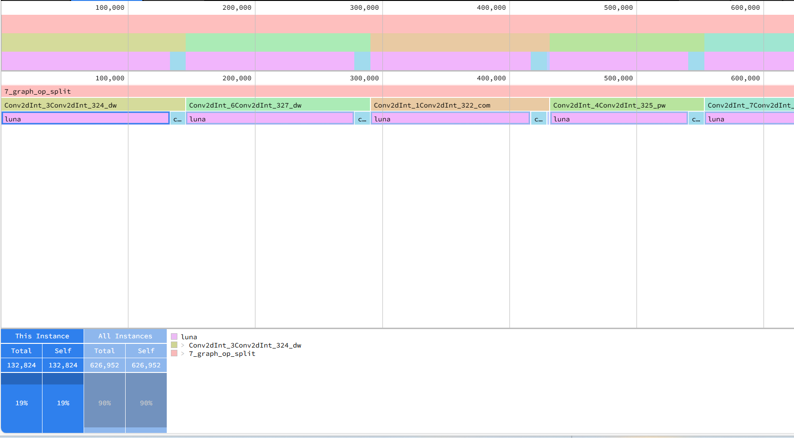

# 说明

当前工具用具评估ONNX模型在LUNA NPU上面的运行耗时，功能主要包括LUNA NPU底层算子的耗时评估、ONNX模型的耗时评估和保存speedscope文件格式。
## 部分限制
1. 只支持以下算子
```
"ArgMax","AvgPool2dInt","BMMInt","BatchNormInt","Cast","Concat","Constant","Conv1dInt","Conv2dInt","ConvTranspose2dInt","Deconv2dInt","Dequant","Flatten","GLUInt","GRUInt","Gather","iqAdd","iqCat","iqDiv","iqMul","iqPad","iqSigmoid","iqSub","iqSum","iqTanh","iqVar","LSTMInt","LayerNormInt","LinearInt","LogSoftmaxInt","MaxPool","Prelu","Quant","ReduceMean","Relu","Requant","Reshape","ShuffleChannel","Slice","SoftmaxInt","Split","Tile","TopK","topn","topn2","Transpose"
```
2. 目前评估只支持激活数据在share memory上的情况
## 操作步骤

1. 安装依赖环境。

```
pip install -r numpy onnx
```
2. 配置thinker环境
- [虚拟环境构建](./docs/thinker_environment.md)
- [源码编译安装](./docs/thinker_build.md)
- [docker镜像](./docs/thinker_docker.md)(包含了linger和thinker)

3. thinker打包模型
[thinker打包教程](./docs/thinker_packer.md)
```
# 导出最后的计算图，默认路径为./xx/model.ignore/*.onnx，其中xx表示输入计算图的名称（名称中如果有"."则取第一个字段）
# 运行命令后取出最后一个计算图，例如7_graph_op_split.onnx
tpacker -g input.onnx -d True
```

4. 生成耗时评估文件，默认speedscope格式

```
tprofile --input ./data/onnx_arcs/7_graph_op_split.onnx --format speedscope --output profile.speedscope
```
5. 结果展示
打开https://www.speedscope.app/网站，导入生成的speedscope文件，生成如下的分析图：
  