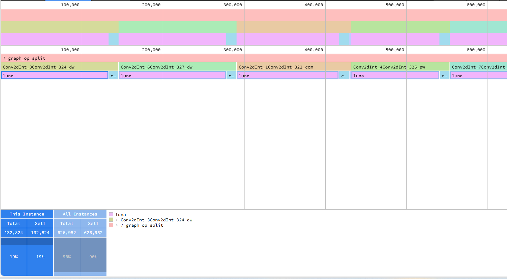

# Thinker 离线性能评估指南

本文档介绍如何使用 `tprofile` 对 Thinker 优化后的 ONNX 图进行离线耗时评估，并导出 `speedscope`、`csv` 或调试文本格式的分析结果。

> 说明
>
> - `tprofile` 输出的是基于目标平台算子模型的离线推理耗时估计，用于方案评估、算子瓶颈分析和图优化验证。
> - 该结果并不是板端实测 wall-clock 时间；真实芯片平台的最终耗时还会受到主频、固件调度、DMA 行为和系统集成方式影响。
> - Thinker 的上层图结构、资源规划和执行流程在仿真平台与真实目标平台之间保持通用，迁移到芯片工程时通常只需要替换底层 `luna` 库和固件/BSP 库。

## 1. 工具定位

`tprofile` 主要用于回答以下问题：

- 哪些算子是当前图中的主要耗时热点；
- 优化前后图结构的总体 cycle 是否下降；
- DMA、CPU 与 LUNA 计算阶段的耗时分布如何；
- 某些算子替换、融合或切分后是否值得继续优化。

当前实现基于 `tools/tprofile/src/luna_profile_arcs.py` 中的代价模型，命令行仅支持 `ARCS` 平台估计。

## 2. 使用前准备

建议先完成以下准备工作：

- 已按 `./thinker_build.md` 安装 `tprofile` 命令行工具。
- 已完成 ONNX 图的 Thinker 化处理，推荐先通过 `tpacker` 导出优化后的中间 ONNX 图。
- 当前评估图应包含较完整的 shape 和算子属性信息，否则某些节点可能无法正确估算。

推荐工作流如下：

1. 使用 `tpacker` 先对原始 ONNX 做参数检查、图优化和内存规划。
2. 从 `workspace/<model_name>/model.ignore/` 中选择最终阶段导出的 ONNX 图。
3. 使用 `tprofile` 对该优化图做离线性能评估。

## 3. 输入限制和适用范围

当前版本有以下实现特征：

- 命令行仅支持 `--platform arcs`。
- 多数耗时模型假设结果主要落在 share memory，部分算子对内存位置有进一步限制。
- 对未建模的算子，工具会打印 warning，并按 `0 cycle` 处理。
- 若 ONNX 图中缺少完整的中间张量信息，工具可能无法找到对应的 value info，建议优先使用 `tpacker` 导出的最终图而不是原始训练导出图。

## 4. 命令格式

```bash
tprofile [options]
```

### 4.1 参数说明

| 参数 | 是否必选 | 说明 |
| --- | --- | --- |
| `--input` | 是 | 待评估 ONNX 图路径 |
| `--output` | 实际必选 | 输出结果文件路径 |
| `--format` | 实际必选 | 输出格式，支持 `speedscope`、`csv`、`debug` |
| `--platform` | 否 | 目标平台，默认 `arcs`，当前也仅支持该取值 |
| `--asynchro` | 否 | 是否按 DMA 与 LUNA 异步重叠模型估算，默认 `True` |
| `--config` | 否 | 预留参数，当前命令行流程未实际使用 |
| `--test` | 否 | 内部调试参数，常规使用可忽略 |

说明：

- 当前实现里 `--output` 和 `--format` 虽然没有在解析器中标记为 required，但实际运行时必须提供。
- `--asynchro` 默认为开启状态，适合用于估算 DMA 与 LUNA 重叠后的整体耗时趋势。

## 5. 典型使用流程

### 5.1 导出优化后的中间 ONNX 图

先让 `tpacker` 输出图优化过程中的 ONNX 文件：

```bash
tpacker -g model/resnet18.onnx -d True -p arcs -o model/resnet18.bin
```

执行完成后，可在以下目录找到中间图：

```text
workspace/resnet18/model.ignore/
```

通常选择最后一个阶段的 ONNX 图进行评估，例如 `7_graph_op_split.onnx`。

### 5.2 导出 speedscope 文件

```bash
tprofile \
  --input workspace/resnet18/model.ignore/7_graph_op_split.onnx \
  --platform arcs \
  --format speedscope \
  --output profile.speedscope
```

### 5.3 导出 CSV 文件

```bash
tprofile \
  --input workspace/resnet18/model.ignore/7_graph_op_split.onnx \
  --platform arcs \
  --format csv \
  --output profile.csv
```

### 5.4 导出调试文本

```bash
tprofile \
  --input workspace/resnet18/model.ignore/7_graph_op_split.onnx \
  --platform arcs \
  --format debug \
  --output profile.txt
```

## 6. 输出结果说明

### 6.1 `speedscope`

`speedscope` 格式适合导入 https://www.speedscope.app/ 做火焰图分析。文件中会按算子拆分出：

- `cpu`
- `dma`
- `luna`

三个耗时分量，便于观察热点主要来自计算、搬运还是控制开销。

示意图如下：



### 6.2 `csv`

CSV 文件首行字段如下：

```text
op_name, op_cycles, cpu_cycles, dma_cycles, luna_cycles
```

适合导入 Excel、Pandas 或内部分析脚本做进一步统计。

### 6.3 `debug`

调试文本会输出更简化的算子级结果，适合快速查看每层的 LUNA 耗时估计。

### 6.4 日志文件

执行 `tprofile` 时，会在当前目录生成：

```text
log_onnx_profile.txt
```

其中包含详细的调试日志、节点属性和 shape 信息，便于排查估算异常。

## 7. 推荐使用方式

- 做总体性能趋势评估时，优先使用 `speedscope` 格式，最适合观察热点分布。
- 做批量对比或版本回归时，优先使用 `csv` 格式，方便自动化处理。
- 如果想确认某个模型是否已经具备可靠的数值一致性，建议先用 `./thinker_validator.md` 完成结果对齐，再进行 `tprofile` 性能分析。
- 当离线估计和板端实测差异较大时，可结合 `./thinker_performance.md` 中的运行期调试开关进一步定位。

## 8. 注意事项

- 请尽量使用 `tpacker` 导出的最终 ONNX 图，避免因为原始图缺少中间信息导致估算失败。
- 当前平台支持是代码级限制，不建议将 `--platform` 改成其他值直接尝试。
- 未建模算子会被记为 `0 cycle`，因此复杂模型的总耗时只能作为趋势参考，不能替代真实板端实测。
