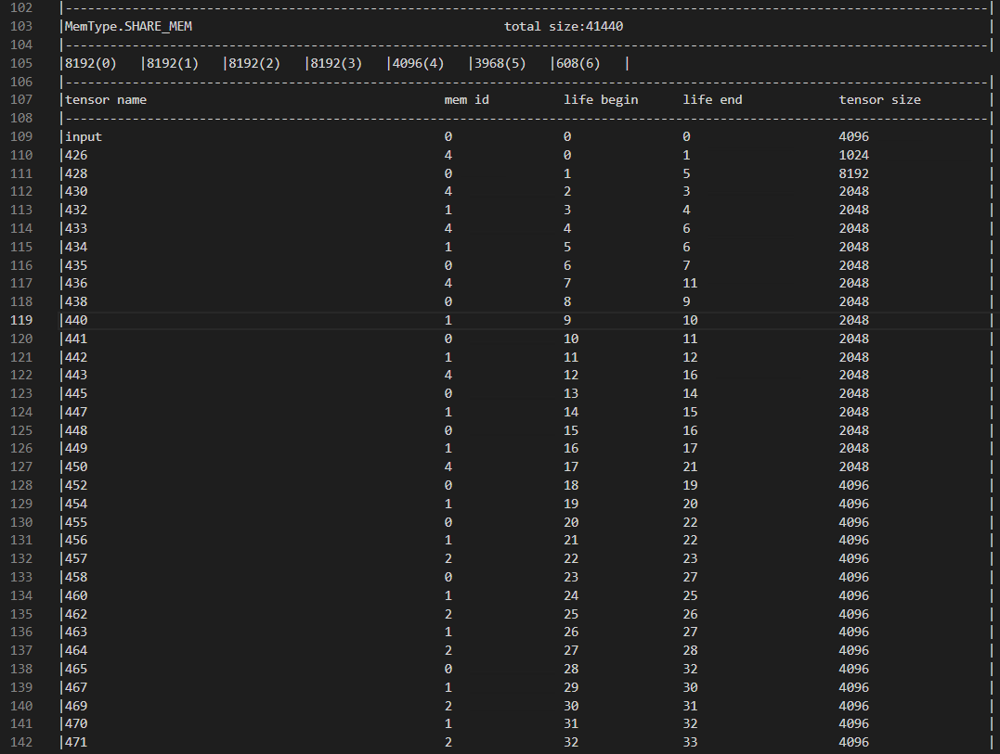

thinker包括离线打包工具和引擎执行器两部分：
离线打包工具提供onnx计算图的加载解析、图优化、Layout转换、op拆分等功能，并对优化后的计算图进行内存分析，将分析结果和图信息序列化，最终生成资源文件（默认存放在根目录下model.pkg）;
引擎执行器解析资源文件，实现全静态内存分配


# Step1-模型打包
```Shell
tpacker -g xx.onnx [-p venus] [-d True] [-m memory] [-o model.bin]
```
* -g ：输入ONNX模型的路径，必须配置
* -p : 目标平台，目前只支持venus，选填项，默认为venus
* -d : 中间计算图导出开关，选填项，默认为False
* -m : 模型参数在venus上存放的位置，选填项，默认为psram，可选项有flash、psram
* -o : 输出的二进制模型资源路径，选填项，默认为./model.pkg

* 以 Resnet50 模型为例，输入:
```Shell
tpacker -g demo/resnet50/resnet50_fashion_mnist.onnx -d True -s Remove_QuantDequant -o demo/resnet50/model.bin
```
其中 -s Remove_QuantDequant 为保留 Quant 与 Dequant 算子, 若能打包成功，则会提示 。

同时会得到内存分析结果。


