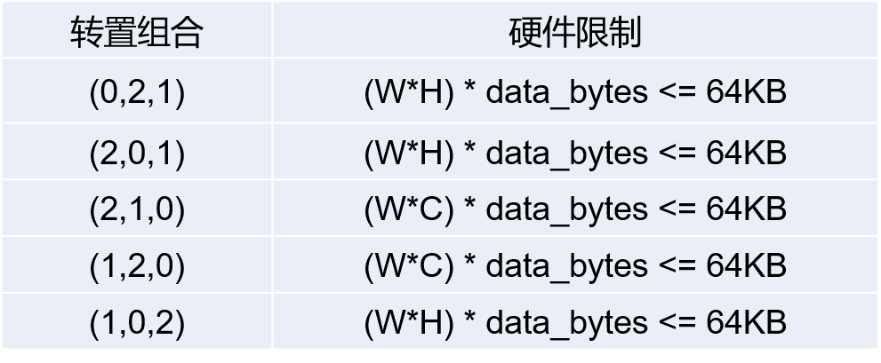

## 一、模型大小限制  
- 运行内存share-mem不超过640KB  
- PSRAM整体可用空间为8MB，内置FLASH可用空间为8MB。单个模型大小整体不超过8M。  
## 二、单个算子限制  
### 1. conv1dint/conv2dint/deconv2dint/pool相关算子共有限制  
  - kernel_size = {1,2,3,4,5},支持kernel_h ≠ kernel_w(conv1dint支持kernel_size >5)
  - stride_size = {1,2,4},支持stride_h ≠ stride_w
  - pad_size = {0,1,2,3},支持四个方向pad独立设置
  - in_w >= weight_w，同时in_h >= weight_h
  - weight_w >= stride_w，同时weight_h >= stride_h
  - pad_h_up < weight_h，同时pad_h_down < weight_h
  - pad_w_right < weight_w, 同时pad_w_left < weight_w
### 2. deconv的限制  
  * stride_h(stride_w) = 2时，kernel_h(kernel_w) = {2,3,4,5}
  * stirde_h(stride_w) = 4时，kernel_h(kernel_w) = {4,5}  
### 3. linearInt/BmmInt的限制  
  * 左边输入矩阵(M*N)对齐后大小不超过64KB  
  * 不同数据类型下对齐方式：  
	数据类型为8bit时，M按4字节对齐，N按8字节对齐；  
	数据类型为16bit时，M按4字节对齐，N按2字节对齐；  
	数据类型为32bit时，M按2字节对齐，N按2字节对齐;
### 4. transpose的限制  
	输入只支持2维/3维，且3维输入数据大小有限制。假设输入维度为NCHW，数据位宽为data_bytes，限制条件如下:
  
## 三、模型量化
    默认情况下所有量化算子均是int8输入int8输出。如需其它精度，请联系我们
